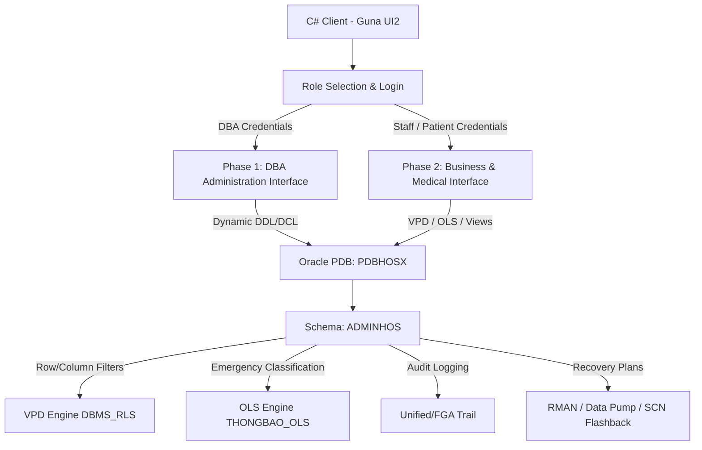

# 🏥 HospitalX - Secure Hospital Management System

[](https://www.oracle.com/database/)
[](https://dotnet.microsoft.com/)
[](https://gunaprisma.com/)
[](https://www.oracle.com/security/)

**HospitalX** is a comprehensive, enterprise-grade hospital management system designed with database-level security as its core pillar. Developed on **Oracle Database (PDB)** and **C# WinForms (.NET Framework)** using **Guna UI2**, the system enforces high-fidelity access control, data masking, multi-level security policies, advanced logging, and automated threat-recovery mechanisms directly at the database engine level.

---

## 📖 Project Overview & Problem Statement

In modern healthcare administration, data security and patient privacy are critical concerns. General information systems often rely solely on application-level logic to restrict access to sensitive medical records and personal details. However, this creates a vulnerability where direct database connections can bypass application guards and expose confidential medical data.

**HospitalX** addresses these security limitations by implementing standard and advanced security policies directly inside the database management system (DBMS), ensuring that:
1. **Granular Privacy**: Doctors can only see patients they are actively treating; patients can only view their own medical histories; and laboratory technicians can only view and update test records assigned to them.
2. **Column-Level Confidentiality**: Sensitive financial or personal columns (e.g., salaries, phone numbers) are masked or restricted dynamically based on the viewer’s active role.
3. **Emergency Broadcast Control**: Notifications are dispatched selectively based on strict hierarchy, department affiliation, and geographic boundaries.
4. **Resilience**: Any unauthorized data tampering is immediately logged via Fine-Grained Auditing (FGA) and can be reverted automatically to its pre-breached state using SCN-based Flashback query recovery.

---

## 🏗️ System Architecture

HospitalX decouples administrative operations (DBA controls) from standard business workflows while routing all data access through secure interfaces.



### Database Schema Model (`ADMINHOS`)

*   **`BENHNHAN`** (Patient): Stores demographics, national ID (`CCCD`), address, allergy lists, and history.
*   **`NHANVIEN`** (Employee): Stores employee records, salary, roles (Coordinator, Physician, Technician, Administrator), and specialty.
*   **`HSBA`** (Medical Record): Holds medical logs, diagnoses, treatment records, and assigned physician (`MABS`).
*   **`HSBA_DV`** (Medical Record Services): Details lab tests, scans, dates, results, and assigned technician (`MAKTV`).
*   **`DONTHUOC`** (Prescription): Details medications, dosages, and corresponding medical records.
*   **`THONGBAO`** (Notification): Contains OLS-protected system broadcasts.

---

## 🔒 Implemented Security Solutions

### 1. Dynamic User & Role Administration (Phase 1)
Designed to automate DBA workflows through a sleek GUI, bypassing direct PL/SQL command-line executions:
*   **Dynamic Identity Management**: Standardized procedures (`sp_CreateUser`, `sp_DropUser`, `sp_ChangeUserPassword`, `sp_CreateRole`, `sp_DropRole`) executing dynamic DDL via `EXECUTE IMMEDIATE`.
*   **System Accounts Exclusion**: System queries use `ORACLE_MAINTAINED = 'N'` to isolate custom roles/users from built-in Oracle administrative accounts.
*   **Advanced Privilege Matrix**: Support for standard grants (SELECT, INSERT, UPDATE, DELETE, EXECUTE) alongside custom-built granular columns controls.
    *   *Column-level SELECT (VPD)*: Oracle does not natively support column-specific SELECT grants. HospitalX implements a tracking table `VPD_COL_TRACKING` mapped to a custom policy function `policy_select_column` which dynamically returns `NULL` for unauthorized columns.
    *   *Column-level SELECT (Views)*: Creates dynamically filtered views (e.g., `V_BENHNHAN_TENBN_NGAYSINH`) based on permitted columns.
    *   *Column-level UPDATE*: Utilizes native Oracle updates constraints (`GRANT UPDATE (cols...) ON table TO role`).

### 2. Fine-Grained Access Control (VPD) (Phase 2)
Business logic rules are enforced directly on tables using Oracle's Virtual Private Database (`DBMS_RLS`):
*   **Coordinator (DPV)**: Has full access to `BENHNHAN`. Can create and view `HSBA` records but can only update `MAKHOA` and `MABS` for medical routing. Can only update `MAKTV` on `HSBA_DV` to assign technicians.
*   **Physician (BS)**: Restricted to viewing `HSBA` records they are actively treating (`MABS = SESSION_USER`). Can view, create, and delete `HSBA_DV` and `DONTHUOC` assigned to their patients. Can view patient profiles under their care and can only modify medical history/allergy columns.
*   **Technician (KTV) & Staff Self-Service**: Mapped via personal views (`VW_HSBA_DV_KTV`, `VW_NHANVIEN_SELF`, `VW_BENHNHAN_SELF`) containing `SYS_CONTEXT('USERENV','SESSION_USER')` filters, combined with custom `INSTEAD OF` triggers (`TRG_VW_..._UPD`) to permit restricted self-updates.

### 3. Oracle Label Security (OLS)
For emergency notifications (`THONGBAO`) where information classification is mandatory:
*   **Levels**: `NV` (Staff - 10) < `LDK` (Department Head - 20) < `BGD` (Board of Directors - 30).
*   **Compartments**: Classified by medical specialty: `TH` (Gastroenterology), `TK` (Neurology), `TM` (Cardiovascular).
*   **Groups**: Bound by geographic branches: `HCM` (Ho Chi Minh City), `HN` (Hanoi), `HP` (Hai Phong).
*   *Implementation Example*: A Board Director in HCM with label `BGD::HCM` can view all broad-level and HCM-specific alerts. A Gastroenterology Nurse in Hanoi with label `NV:TH:HN` is restricted to viewing general staff notifications and gastroenterology updates within the Hanoi branch.

### 4. Database Auditing
Tracks database transactions and detects anomalies:
*   **Standard Auditing**: Audits failed login attempts, unauthorized queries/updates on `HSBA`, self-service views, and executions of sensitive stored procedures/functions.
*   **Fine-Grained Auditing (FGA)**: Captures precise actions:
    *   `FGA_DONTHUOC_UPDATE`: Fires when doctors edit existing prescription values.
    *   `FGA_HSBA_UPDATE_BATHOPPHAP`: Activates when a user tries to alter a medical record assigned to a different doctor.
    *   `FGA_HSBA_DV_INSERT_BATHOPPHAP`: Tracks unauthorized additions to diagnostic service charges.

### 5. Automated Backup & Recovery
*   **Physical & Logical**: Incorporates full physical database backups through RMAN in `ARCHIVELOG` mode and automated daily logical dumps via Oracle Data Pump (`DBMS_DATAPUMP` + `DBMS_SCHEDULER`).
*   **FGA-Driven Flashback Recovery**: If unauthorized modifications are detected:
    1.  An automated PL/SQL script reads the audit trail (`DBA_FGA_AUDIT_TRAIL`) to locate the exact execution timestamp of the security breach.
    2.  Converts the timestamp to a System Change Number (`TIMESTAMP_TO_SCN`).
    3.  Queries the data states immediately prior to the breach using Flashback Query (`AS OF SCN`).
    4.  Restores the original records back to the active production tables.

---

## 🛠️ Installation & Setup Guide

### 1. Pluggable Database (PDB) Setup
Ensure Oracle Database is installed. Connect via SQL Plus or SQL Developer as `SYSDBA` and execute:
```sql
-- Create a isolated pluggable database
CREATE PLUGGABLE DATABASE PDBHOSX ADMIN USER pdbadmin IDENTIFIED BY 123;

-- Open PDB and save its state for persistent startup
ALTER PLUGGABLE DATABASE PDBHOSX OPEN;
ALTER PLUGGABLE DATABASE PDBHOSX SAVE STATE;
```

### 2. Configure Database Schema
Connect to `PDBHOSX` as `sysdba` and execute the SQL script packages:
*   **Phase 1 (User Management)**: Run [CQ2026-CQ12-PH1-ScriptCSDL.sql](file:///d:/HK6/ATBM/Project/script/CQ2026-CQ12-PH1-ScriptCSDL.sql) to initialize `adminHos` manager account, security policies tracking tables, and DBA routines.
*   **Phase 2 (Business Logic)**: Run [CQ2026-CQ12-PH2-ScriptCSDL.sql](file:///d:/HK6/ATBM/Project/script/CQ2026-CQ12-PH2-ScriptCSDL.sql) to populate schemas, register VPD policies, configure OLS labels, apply FGA policies, and deploy automatic Flashback procedures.

### 3. Build C# Client App
1.  Open [HospitalX.sln](file:///d:/HK6/ATBM/Project/HospitalX.sln) using Visual Studio.
2.  Update connection credentials in `App.config` or inside `DAO/DataProvider.cs` to match your local `PDBHOSX` data source.
3.  Build and run the solution.
4.  *Note:* The UI supports a **Smart Bypass Mode** which automatically fills sample credentials (`admin_ph1`, `DP0001`, `BS0001`, etc.) and uses mocked datasets if a live Oracle database instance is unavailable during initial design reviews.

---

## 👥 Project Team

*   **Course**: Information System Security (ATBM HTTT) - FIT HCMUS (Class CQ2023/1)
*   **Group**: Nhóm 12
*   **Members**:
    1.  **Nguyễn Thị Trúc Hằng** (MSSV: 23120201) — **Team Leader** 👑
    2.  Hoàng Quốc Việt (MSSV: 23120189)
    3.  Trần Kim Yến (MSSV: 23120193)
    4.  Lê Hoàng Nhật Anh (MSSV: 23120209)
    5.  Lê Lâm Trí Đức (MSSV: 23120237)

---

## 📊 Task Allocation & Evaluation (Phân công và Đánh giá)

### Phase 1: User Administration & Data Security

| Student ID | Full Name | Tasks & Responsibilities | Status / Completion | Contribution |
| :---: | :--- | :--- | :---: | :---: |
| **23120189** | Hoàng Quốc Việt | - Configured SQL script for Requirement 1<br>- Designed & built Phase 1 application user interface | 100%<br>100% | **20%** |
| **23120193** | Trần Kim Yến | - Configured SQL script for Requirement 3<br>- Handled database connection and integrated app features | 100%<br>100% | **20%** |
| **23120201** | **Nguyễn Thị Trúc Hằng** (Leader) | - Configured SQL script for Requirement 2<br>- Designed & built Phase 1 application user interface | 100%<br>100% | **20%** |
| **23120209** | Lê Hoàng Nhật Anh | - Configured SQL script for Requirement 5 & helper routines<br>- Recorded and post-produced demo videos | 100%<br>100% | **20%** |
| **23120237** | Lê Lâm Trí Đức | - Configured SQL script for Requirement 4 & helper routines<br>- Managed documentation and prepared project reports | 100%<br>100% | **20%** |

### Phase 2: Hospital Business Management & Advanced Security

| Student ID | Full Name | Tasks & Responsibilities | Status / Completion | Contribution |
| :---: | :--- | :--- | :---: | :---: |
| **23120189** | Hoàng Quốc Việt | - Setup SQL scripts for Requirement 1 - Question 1<br>- Implemented backup routines for Requirement 4 - Question 1<br>- Built Phase 2 application UI screens<br>- Researched & presented theory for Phase 2 Req 3 (Auditing)<br>- Recorded demo videos & performed integration testing | 100%<br>100%<br>100%<br>100%<br>100% | **20%** |
| **23120193** | Trần Kim Yến | - Setup SQL scripts for Requirement 3 (Auditing)<br>- Connected DB services and implemented application logic<br>- Researched & presented core theory for Phase 1<br>- Validated report documentation & tested business features | 100%<br>100%<br>100%<br>100% | **20%** |
| **23120201** | **Nguyễn Thị Trúc Hằng** (Leader) | - Setup SQL scripts for Requirement 1 - Question 3 (VPD)<br>- Implemented recovery systems for Req 4 - Questions 3 & 4<br>- Built Phase 2 application UI screens<br>- Researched & presented theory for Phase 2 Req 2 (OLS)<br>- Formatted, compiled final reports, and tested application | 100%<br>100%<br>100%<br>100%<br>100% | **20%** |
| **23120209** | Lê Hoàng Nhật Anh | - Setup SQL scripts for Requirement 2 (OLS)<br>- Managed DB connections & implemented OLS view bindings<br>- Researched & presented theory for Phase 2 Req 1 (VPD)<br>- Edited, synchronized demo video and tested application | 100%<br>100%<br>100%<br>100% | **20%** |
| **23120237** | Lê Lâm Trí Đức | - Setup SQL scripts for Requirement 1 - Question 2 (VPD)<br>- Implemented backup scheduling for Req 4 - Question 2<br>- Built Phase 2 application UI screens<br>- Researched & presented theory for Phase 2 Req 4 (Backup/Recovery)<br>- Documented build instructions, deployment guide & tested app | 100%<br>100%<br>100%<br>100%<br>100% | **20%** |
