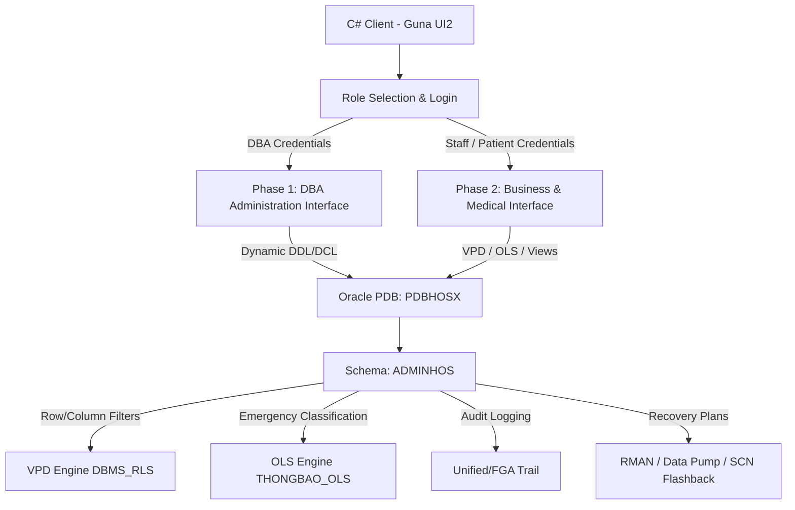

# 🏥 HospitalX - Secure Hospital Management System

[](https://www.oracle.com/database/)
[](https://dotnet.microsoft.com/)
[](https://gunaprisma.com/)
[](https://www.oracle.com/security/)

**HospitalX** is a comprehensive, enterprise-grade hospital management system designed with database-level security as its core pillar. Developed on **Oracle Database (PDB)** and **C# WinForms (.NET Framework)** using **Guna UI2**, the system enforces high-fidelity access control, data masking, multi-level security policies, advanced logging, and automated threat-recovery mechanisms directly at the database engine level.

---

## 📖 Project Overview & Problem Statement

In modern healthcare administration, data security and patient privacy are critical concerns. General information systems often rely solely on application-level logic to restrict access to sensitive medical records and personal details. However, this creates a vulnerability where direct database connections can bypass application guards and expose confidential medical data.

**HospitalX** addresses these security limitations by implementing standard and advanced security policies directly inside the database management system (DBMS), ensuring that:
1. **Granular Privacy**: Doctors can only see patients they are actively treating; patients can only view their own medical histories; and laboratory technicians can only view and update test records assigned to them.
2. **Column-Level Confidentiality**: Sensitive financial or personal columns (e.g., salaries, phone numbers) are masked or restricted dynamically based on the viewer’s active role.
3. **Emergency Broadcast Control**: Notifications are dispatched selectively based on strict hierarchy, department affiliation, and geographic boundaries.
4. **Resilience**: Any unauthorized data tampering is immediately logged via Fine-Grained Auditing (FGA) and can be reverted automatically to its pre-breached state using SCN-based Flashback query recovery.

---

## 🏗️ System Architecture

HospitalX decouples administrative operations (DBA controls) from standard business workflows while routing all data access through secure interfaces.



### Database Schema Model (`ADMINHOS`)

*   **`BENHNHAN`** (Patient): Stores demographics, national ID (`CCCD`), address, allergy lists, and history.
*   **`NHANVIEN`** (Employee): Stores employee records, salary, roles (Coordinator, Physician, Technician, Administrator), and specialty.
*   **`HSBA`** (Medical Record): Holds medical logs, diagnoses, treatment records, and assigned physician (`MABS`).
*   **`HSBA_DV`** (Medical Record Services): Details lab tests, scans, dates, results, and assigned technician (`MAKTV`).
*   **`DONTHUOC`** (Prescription): Details medications, dosages, and corresponding medical records.
*   **`THONGBAO`** (Notification): Contains OLS-protected system broadcasts.

---

## 🔒 Implemented Security Solutions

### Phase 1: Database Administration (DBA) Security Core
The first subsystem is built specifically for the Database Administrator (DBA - `adminHos`) to monitor and configure database-level access controls through a dynamic WinForms GUI, eliminating manual PL/SQL scripts.

*   **Dynamic Identity Management (CRUD User/Role)**: 
    *   DDL encapsulation procedures (`sp_CreateUser`, `sp_DropUser`, `sp_ChangeUserPassword`, `sp_LockUser`, `sp_UnlockUser`) wrap complex operations inside dynamic DDL executions (`EXECUTE IMMEDIATE`).
    *   Profile isolation: Decouples native database authentication from general user attributes by storing descriptive employee profiles in the `THONGTIN_NHANVIEN` table.
    *   Role lifecycle management procedures (`sp_CreateRole`, `sp_DropRole`) automate dynamic role provisioning.
*   **System Accounts Exclusion**:
    *   Queries on data dictionary views filter out default system accounts using `ORACLE_MAINTAINED = 'N'` and filter out administrative accounts (e.g., `ADMINHOS`, `PDBADMIN`, `C##%`), presenting only custom application users and roles.
*   **Granular Privilege Control (Table & Column Level)**:
    *   *Column-level SELECT on Tables (Custom VPD)*: Enforces select restrictions on specific columns (e.g., `LUONG_CO_BAN` in `LUONG_NHANVIEN`). The DBA tracks hidden columns in `VPD_COL_TRACKING`, which are fed into a policy function returning `1=2` (triggering dynamic column masking using `DBMS_RLS.ALL_ROWS` to render values as `NULL`).
    *   *Column-level SELECT on Views*: Automatically compiles combined view projections (e.g., `V_BENHNHAN_TENBN_NGAYSINH`) on demand for user queries.
    *   *Column-level UPDATE*: Controls updates on granular columns via native Oracle grants (`GRANT UPDATE(cols) ON table`).
*   **Privilege Auditing & Dashboard**:
    *   Consolidates object privileges (including column-level VPD restrictions), system privileges, and active role configurations for quick checks.
    *   Live stat indicators track active users, roles, granted privileges, and active database components.

### Phase 2: Hospital Business & Data Security Policies
The second subsystem enforces role-based workflows and advanced data protection policies at the core database level for hospital staff and patients.

*   **Business Role-Based Access Control (RBAC)**:
    *   Provisions database roles (`ROLE_BENHNHAN`, `ROLE_KTV`, `ROLE_BACSI`, `ROLE_DPV`) with corresponding permissions mapped to staff profiles.
*   **Fine-Grained Row-Level Policies (VPD)**:
    *   *Coordinators (DPV)*: Access full patient data but can only update routing fields (`MAKHOA`, `MABS` in `HSBA`) and technician assignments (`MAKTV` in `HSBA_DV`).
    *   *Physicians (BS)*: Can only view patient records (`HSBA`) they are actively treating (`MABS = SESSION_USER`). Can view profiles under their care and are restricted to updating medical history/allergy lists.
    *   *Technicians & Patients*: Restricted to personal data subsets mapped via views (`VW_HSBA_DV_KTV`, `VW_NHANVIEN_SELF`, `VW_BENHNHAN_SELF`) containing `SYS_CONTEXT('USERENV','SESSION_USER')` filters, combined with `INSTEAD OF` triggers (`TRG_VW_..._UPD`) for restricted updates.
*   **Oracle Label Security (OLS)**:
    *   Protects emergency broadcasts (`THONGBAO`) via a multi-dimensional label configuration (`THONGBAO_OLS` on `THONGBAO` table):
        *   *Levels*: `NV` (Staff - 10) < `LDK` (Department Head - 20) < `BGD` (Board of Directors - 30).
        *   *Compartments*: Specialty divisions: `TH` (Gastroenterology), `TK` (Neurology), `TM` (Cardiovascular).
        *   *Groups*: Geographic branches: `HCM`, `HN`, `HP`.
*   **Database Activity Logging**:
    *   *Standard Auditing*: Tracks failed login attempts, unauthorized queries on `HSBA`, self-service views, and executions of sensitive stored procedures/functions.
    *   *Fine-Grained Auditing (FGA)*: Captures specific events, including prescription changes (`FGA_DONTHUOC_UPDATE`) and unauthorized updates to other doctors' records (`FGA_HSBA_UPDATE_BATHOPPHAP`).
*   **Flashback Threat Recovery**:
    *   Automates recovery from data tampering. A PL/SQL routine parses the FGA log (`DBA_FGA_AUDIT_TRAIL`) to locate the exact execution timestamp of the breach, converts the timestamp to a System Change Number (SCN), queries the pre-breached data using Flashback Query (`AS OF SCN`), and restores the records.

---

## 🛠️ Installation & Setup Guide

### 1. Pluggable Database (PDB) Setup
Ensure Oracle Database is installed. Connect via SQL Plus or SQL Developer as `SYSDBA` and execute:
```sql
-- Create an isolated pluggable database
CREATE PLUGGABLE DATABASE PDBHOSX ADMIN USER pdbadmin IDENTIFIED BY 123;

-- Open PDB and save its state for persistent startup
ALTER PLUGGABLE DATABASE PDBHOSX OPEN;
ALTER PLUGGABLE DATABASE PDBHOSX SAVE STATE;
```

### 2. Configure Database Schema
Connect to `PDBHOSX` as `sysdba` and execute the SQL script packages:
*   **Phase 1 (User Management)**: Run [CQ2026-CQ12-PH1-ScriptCSDL.sql](../Project/script/CQ2026-CQ12-PH1-ScriptCSDL.sql) to initialize `adminHos` manager account, security policies tracking tables, and DBA routines.
*   **Phase 2 (Business Logic)**: Run [CQ2026-CQ12-PH2-ScriptCSDL.sql](../Project/script/CQ2026-CQ12-PH2-ScriptCSDL.sql) to populate schemas, register VPD policies, configure OLS labels, apply FGA policies, and deploy automatic Flashback procedures.

### 3. Build C# Client App
1.  Open [HospitalX.sln](../Project/HospitalX.sln) using Visual Studio.
2.  Update connection credentials in `App.config` or inside `DAO/DataProvider.cs` to match your local `PDBHOSX` data source.
3.  Build and run the solution.
4.  *Note:* The UI supports a **Smart Bypass Mode** which automatically fills sample credentials (`admin_ph1`, `DP0001`, `BS0001`, etc.) and uses mocked datasets if a live Oracle database instance is unavailable during initial design reviews.

---

## 👥 Project Team

*   **Course**: Information System Security - FIT HCMUS (Class CQ2023/1)
*   **Group**: CQ12
*   **Members (Sorted by Student ID)**:
1.  Hoàng Quốc Việt (MSSV: 23120189)
2.  Trần Kim Yến (MSSV: 23120193) — Team Leader    
3.  Nguyễn Thị Trúc Hằng (MSSV: 23120201)
4.  Lê Hoàng Nhật Anh (MSSV: 23120209)
5.  Lê Lâm Trí Đức (MSSV: 23120237)

---

## 📊 Task Allocation & Evaluation

### Phase 1: User Administration & Data Security

| Student ID | Full Name | Tasks & Responsibilities | Status / Completion | Contribution |
| :---: | :--- | :--- | :---: | :---: |
| **23120189** | Hoàng Quốc Việt | - Configured SQL script for Requirement 1<br>- Designed & built Phase 1 application user interface | 100%<br>100% | **20%** |
| **23120193** | Trần Kim Yến (Leader) | - Configured SQL script for Requirement 3<br>- Handled database connection and integrated app features | 100%<br>100% | **20%** |
| **23120201** | Nguyễn Thị Trúc Hằng | - Configured SQL script for Requirement 2<br>- Designed & built Phase 1 application user interface | 100%<br>100% | **20%** |
| **23120209** | Lê Hoàng Nhật Anh | - Configured SQL script for Requirement 5 & helper routines<br>- Recorded and post-produced demo videos | 100%<br>100% | **20%** |
| **23120237** | Lê Lâm Trí Đức | - Configured SQL script for Requirement 4 & helper routines<br>- Managed documentation and prepared project reports | 100%<br>100% | **20%** |

### Phase 2: Hospital Business Management & Advanced Security

| Student ID | Full Name | Tasks & Responsibilities | Status / Completion | Contribution |
| :---: | :--- | :--- | :---: | :---: |
| **23120189** | Hoàng Quốc Việt | - Setup SQL scripts for Requirement 1 - Question 1<br>- Implemented backup routines for Requirement 4 - Question 1<br>- Built Phase 2 application UI screens<br>- Researched & presented theory for Phase 2 Req 3 (Auditing)<br>- Recorded demo videos & performed integration testing | 100%<br>100%<br>100%<br>100%<br>100% | **20%** |
| **23120193** | Trần Kim Yến (Leader) | - Setup SQL scripts for Requirement 3 (Auditing)<br>- Connected DB services and implemented application logic<br>- Researched & presented core theory for Phase 1<br>- Validated report documentation & tested business features | 100%<br>100%<br>100%<br>100% | **20%** |
| **23120201** | Nguyễn Thị Trúc Hằng | - Setup SQL scripts for Requirement 1 - Question 3 (VPD)<br>- Implemented recovery systems for Req 4 - Questions 3 & 4<br>- Built Phase 2 application UI screens<br>- Researched & presented theory for Phase 2 Req 2 (OLS)<br>- Formatted, compiled final reports, and tested application | 100%<br>100%<br>100%<br>100%<br>100% | **20%** |
| **23120209** | Lê Hoàng Nhật Anh | - Setup SQL scripts for Requirement 2 (OLS)<br>- Managed DB connections & implemented OLS view bindings<br>- Researched & presented theory for Phase 2 Req 1 (VPD)<br>- Edited, synchronized demo video and tested application | 100%<br>100%<br>100%<br>100% | **20%** |
| **23120237** | Lê Lâm Trí Đức | - Setup SQL scripts for Requirement 1 - Question 2 (VPD)<br>- Implemented backup scheduling for Req 4 - Question 2<br>- Built Phase 2 application UI screens<br>- Researched & presented theory for Phase 2 Req 4 (Backup/Recovery)<br>- Documented build instructions, deployment guide & tested app | 100%<br>100%<br>100%<br>100%<br>100% | **20%** |
